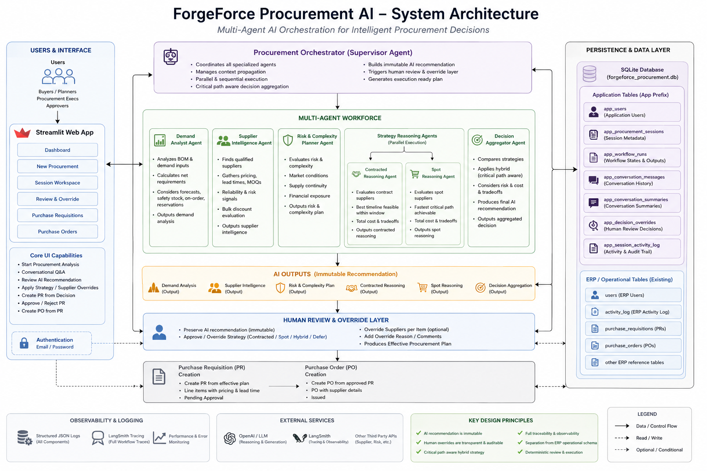
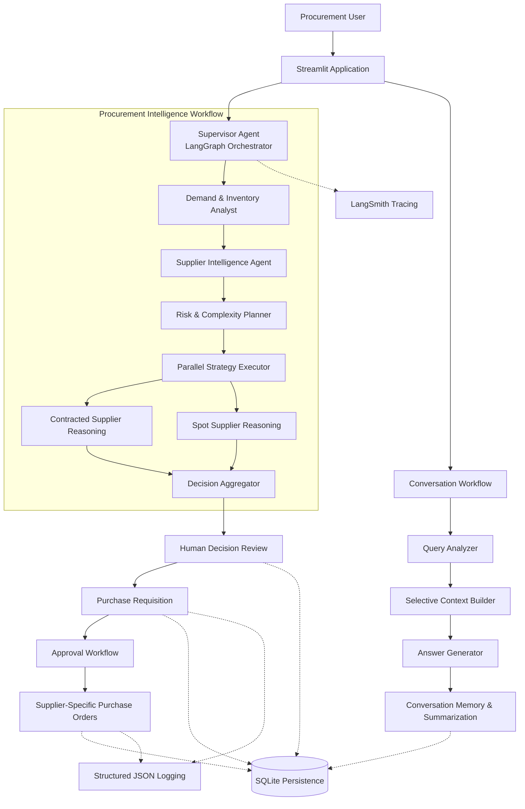

# ForgeForce Procurement AI

**Production-Grade Multi-Agent Procurement Intelligence Platform**

_Combining deterministic procurement planning, AI-powered supplier reasoning, human-in-the-loop decision making, and enterprise workflow orchestration._

---

## High-Level Architecture

---

# Overview

ForgeForce Procurement AI is a production-style procurement intelligence platform that demonstrates how deterministic business workflows, Large Language Models (LLMs), and human expertise can work together to support enterprise purchasing decisions.

Rather than allowing an LLM to make procurement decisions directly, the platform combines deterministic planning algorithms with explainable AI reasoning. Business-critical calculations—including inventory planning, supplier enrichment, procurement strategy selection, purchase requisition generation, and purchase order creation—are performed through deterministic logic, while LLMs are responsible only for evaluating trade-offs, explaining recommendations, and supporting human decision-making.

The system follows a Human-in-the-Loop (HITL) architecture where every AI recommendation remains immutable for auditability. Procurement specialists may review, approve, or override recommendations before Purchase Requisitions (PRs) are generated. Every change is persisted, fully traceable, and preserved throughout the procurement lifecycle.

In addition to the procurement workflow, ForgeForce includes a stateful conversational assistant capable of answering procurement questions, explaining supplier recommendations, retrieving workflow history, and providing contextual assistance using persistent conversation memory.

The result is an end-to-end procurement platform that combines:

- Deterministic procurement planning
- Multi-agent workflow orchestration
- Explainable AI reasoning
- Human review and approval
- Persistent conversation intelligence
- Enterprise auditability
- Production observability

---

# Platform Highlights

| Capability                          | Description                                                                                                                     | Status |
| ----------------------------------- | ------------------------------------------------------------------------------------------------------------------------------- | :----: |
| 🤖 Multi-Agent Procurement Workflow | End-to-end AI workflow for demand planning, supplier intelligence, reasoning, review, PR creation, approval, and PO generation. |   ✅   |
| 🧠 Deterministic + AI Architecture  | Business calculations remain deterministic while LLMs perform explainable reasoning and decision support.                       |   ✅   |
| ⚡ Parallel Supplier Reasoning      | Contracted and Spot procurement strategies execute concurrently for every required item.                                        |   ✅   |
| 🎯 Critical Path Optimization       | Hybrid procurement minimizes production delays while balancing procurement cost.                                                |   ✅   |
| 👨‍💼 Human-in-the-Loop Review         | Reviewers can approve AI recommendations or override strategy and suppliers with complete audit history.                        |   ✅   |
| 💾 Persistent Procurement Sessions  | Procurement analyses, conversations, and review decisions survive refreshes and application restarts.                           |   ✅   |
| 💬 Stateful Procurement Assistant   | LangGraph-powered conversational assistant with contextual retrieval, memory, and procurement-specific Q&A.                     |   ✅   |
| 📋 Purchase Requisition Workflow    | Converts reviewed procurement recommendations into enterprise Purchase Requisitions.                                            |   ✅   |
| 📦 Purchase Order Generation        | Approved Purchase Requisitions automatically generate supplier-specific Purchase Orders.                                        |   ✅   |
| 📈 LangSmith Observability          | End-to-end workflow tracing with nested execution visibility and performance insights.                                          |   ✅   |
| 📝 Structured JSON Logging          | Production-grade centralized logging with audit-friendly event tracking.                                                        |   ✅   |
| 🔍 Enterprise Audit Trail           | Preserves immutable AI recommendations alongside all human decisions and overrides.                                             |   ✅   |

# Why ForgeForce?

Traditional AI procurement demonstrations typically generate supplier recommendations directly from an LLM. While impressive, those approaches often lack determinism, traceability, and governance—qualities that are essential in enterprise procurement.

ForgeForce addresses these challenges by separating deterministic business logic from AI reasoning.

Business rules determine **what is possible**, while AI helps explain **what is preferable**.

This architectural separation produces procurement recommendations that are:

- Explainable
- Repeatable
- Auditable
- Human-reviewable
- Enterprise-ready

The platform demonstrates how AI can augment procurement professionals instead of replacing existing procurement governance.

---

# Key Features

## Multi-Agent Procurement Workflow

- Demand and inventory analysis
- Supplier intelligence enrichment
- Risk and complexity planning
- Parallel contracted supplier reasoning
- Parallel spot supplier reasoning
- Critical-path-aware hybrid procurement
- Deterministic decision aggregation

---

## Human-in-the-Loop Decision Making

- Immutable AI recommendations
- Strategy overrides
- Item-level supplier overrides
- Reviewer comments
- Complete audit trail
- Persistent decision history

---

## Enterprise Procurement Lifecycle

- Purchase Recommendation generation
- Purchase Requisition creation
- Approval workflow
- Purchase Order generation
- Execution supervision
- Deterministic PR → PO orchestration

---

## Conversational Procurement Assistant

- Stateful conversation memory
- Context-aware procurement Q&A
- Workflow explanation
- Supplier reasoning explanation
- Session persistence
- Entity-aware retrieval
- Conversation summarization

---

## Enterprise Engineering

- LangGraph orchestration
- LangSmith observability
- Structured JSON logging
- SQLite persistence
- Modular architecture
- Production-grade error handling
- Smoke-test coverage
- Fully deterministic execution

---

## Platform at a Glance

ForgeForce uses a LangGraph-based Supervisor Agent to orchestrate the procurement workflow. Deterministic agents prepare and enrich procurement data, LLM-powered reasoning evaluates supplier trade-offs, and human reviewers retain final decision authority before PR and PO execution.

